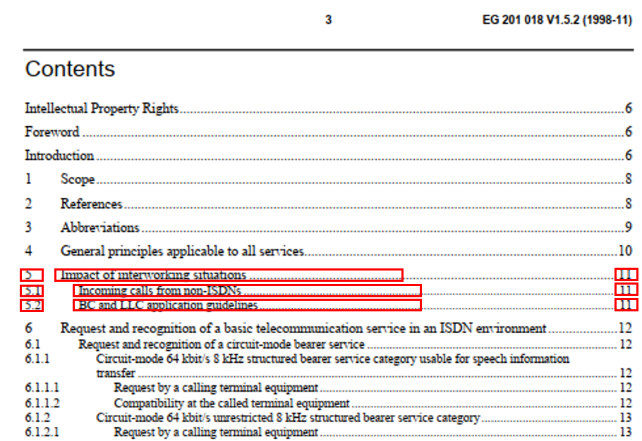
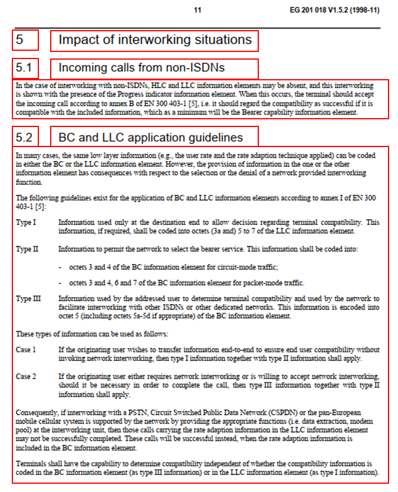

# techStandards

<!-- badges: start -->
[](https://www.repostatus.org/#active)
[](https://lifecycle.r-lib.org/articles/stages.html#stable-1)
<!-- badges: end -->

Download and parse technical standard documents


## Introduction

This repository contains functions to download standard documents from the [ETSI website](https://www.etsi.org/standards) and parse standard documents. For related functions (e.g., accessing ITU-T standard documents), see [here](https://github.com/lorenzbr/pystandards).

## Installation

You can install the development version from [GitHub](https://github.com/) with:

``` r
# install.packages("devtools")
devtools::install_github("lorenzbr/techStandards")
```


## Example


```r
library(techStandards)

## Examples

# Download ETSI standard documents
data("etsi_standards_meta")
download_etsi_standards(etsi_standards_meta)

# Parse a single standard document
files <- list.files(system.file("extdata/etsi_examples", package = "techStandards"), 
                    pattern = "pdf", full.names = TRUE)
file <- files[1]
parse_standard_doc(file, path = "inst/extdata/etsi_examples", sso = "ETSI", overwrite = TRUE)

# Parse all standard documents
parse_standard_docs(path = "inst/extdata/etsi_examples", sso = "ETSI", overwrite = TRUE)
```


## What does the standard document parser do?

Technical standards are often described in extremely large documents comprising hundreds and sometimes thousands of pages. This can lead to huge challenges for NLP and ML models dealing with such large texts. Thus, it is helpful to consider smaller parts of a standard and apply your model of choice to those. To select specific chapters, sections or paragraphs of a technical standard, this parser identifies the table of contents of a standard document and searches for the corresponding text using the title of the section and the page number as specified in the table of contents. The output are csv files with the structured text data (full text for each paragraph as outlined in the table of contents). Currently, the text data is also aggregated on chapter level and is stored in a separate txt file. The algorithm is based on regular expressions and excact as well as string similarity matches. While it works very well for most standard, for some, the parsing fails or may not be that accurate. A log file with further details and messages is also outputted.

The two following pictures show an excerpt of a standard document. The red boxes highlight some information which is used by the standard document parser.






## Contact

Please contact <lorenz.brachtendorf@gmx.de> if you want to contribute to this project.

You can also submit bug reports and suggestions via e-mail or <https://github.com/lorenzbr/techStandards/issues> 


## License

This R package is licensed under the GNU General Public License v3.0.

See [here](https://github.com/lorenzbr/techStandards/blob/master/LICENSE) for further information.
